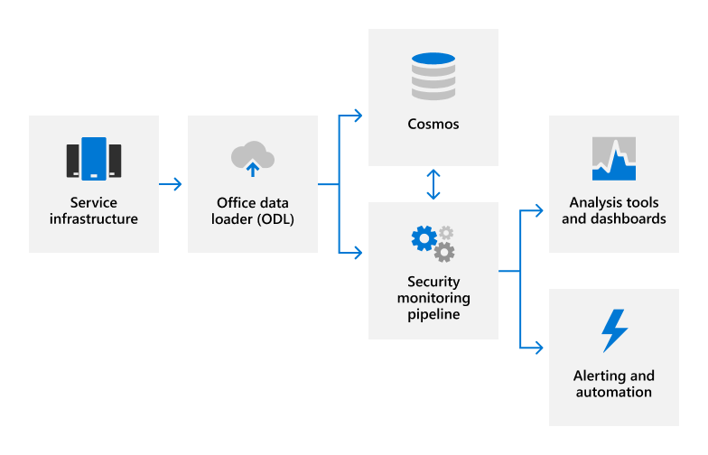

# Обзор журнала аудита

## Как веб-службы Майкрософт используют журнал аудита?

Веб-службы Майкрософт используют журнал аудита для обнаружения несанкционированных действий и обеспечения подотчетности сотрудников Корпорации Майкрософт. Журналы аудита фиксировать сведения об изменениях конфигурации системы и событиях доступа, а также сведения о том, кто несет ответственность за эту деятельность, когда и где она проводилась, и каковы результаты этого действия. Автоматизированный анализ журналов поддерживает обнаружение подозрительного поведения в режиме реального времени. Потенциальные инциденты перенабовеяются в соответствующую команду реагирования на безопасность Майкрософт для дальнейшего расследования.

Внутренний журнал аудита служб Майкрософт в интернете захватывает данные журналов из различных источников, таких как:

- Журналы событий
- Журналы AppLocker
- Данные о производительности
- System Center данных
- Записи детализации вызовов
- Качество данных об опыте
- Журналы веб-сервера IIS
- SQL Server журналы
- Данные Syslog
- Журналы аудита безопасности

## Как веб-службы Майкрософт централизуют журналы аудита и сообщают о них?

Многие различные типы данных журнала загружаются с серверов Майкрософт в запатентованное решение мониторинга безопасности для анализа в режиме реального времени (NRT) и внутреннюю службу вычислений больших данных (Cosmos) или Azure Data Explorer (Kusto) для долгосрочного хранения. Этот перенос данных происходит через подключение TLS с проверкой FIPS 140-2 в утвержденных портах и протоколах с помощью автоматизированных средств управления журналами.

Журналы обрабатываются в NRT с помощью методов, основанных на правилах, статистических данных и машинного обучения для обнаружения показателей производительности системы и потенциальных событий безопасности. Модели машинного обучения используют входящие данные журнала и исторические данные журнала, хранимые в Cosmos или Kusto, чтобы непрерывно улучшать возможности обнаружения. Обнаружения, связанные с безопасностью, создают оповещения, оповещают дежурных инженеров о потенциальном инциденте и запускают автоматические действия по исправлению, если это применимо. Кроме автоматического мониторинга безопасности, группы служб используют средства анализа и панели мониторинга для корреляции данных, интерактивных запросов и аналитики данных. Эти отчеты используются для мониторинга и повышения общей производительности службы.

Дополнительные сведения о мониторинге безопасности и оповещении см. в [обзоре мониторинга безопасности.](assurance-security-monitoring.md)

## Как интернет-службы Майкрософт защищают журналы аудита?

Средства, используемые в сетевых службах Майкрософт для сбора и обработки записей аудита, не позволяют вносить постоянные или необратимые изменения в исходное содержимое записи аудита или порядок времени. Доступ к данным онлайн-служб Майкрософт, хранимым в Cosmos или Кусто, ограничен уполномоченным персоналом. Кроме того, Корпорация Майкрософт ограничивает управление журналами аудита ограниченным подмножеством членов группы безопасности, отвечающих за функции аудита. Сотрудники группы безопасности не имеют постоянного административного доступа к Cosmos kusto. Для административного доступа требуется утверждение доступа к just-in-time (JIT), и все изменения в механизмах ведения журнала для Cosmos записывают и проверяют. Журналы аудита сохраняются достаточно долго, чтобы поддерживать расследования инцидентов и соответствовать нормативным требованиям. Точный период хранения данных журнала аудита, определяемого группами служб; большинство данных журнала аудита сохраняется в течение 90 дней в Cosmos и 180 дней в Kusto.

## Как интернет-службы Майкрософт защищают персональные данные пользователей, которые могут быть захвачены в журналах аудита?

Перед отправкой данных журналов приложение автоматического управления журналами использует службу очистки, чтобы удалить все поля, содержащие данные клиентов, такие как данные клиента и персональные данные пользователей, и заменить эти поля значением hash. Анонимизированные и схващенные журналы переписываются и затем загружаются в Cosmos. Все передачи журналов происходят через зашифрованное подключение TLS (FIPS 140-2).

## Связанные внешние правила & сертификации

Онлайн-службы Корпорации Майкрософт регулярно проверяются на соответствие внешним требованиям и сертификациям. Обратитесь к следующей таблице для проверки элементов управления, связанных с ведением журнала аудита.

### Azure и Dynamics 365

| **Внешние аудиты** | **Section** | **Дата последнего отчета** |
|:--------------------|:------------|:-----------------------|
| [ISO 27001/27002](https://servicetrust.microsoft.com/ViewPage/MSComplianceGuideV3?command=Download&downloadType=Document&downloadId=e9116047-f327-430c-a83f-166b7e561ad6&tab=7027ead0-3d6b-11e9-b9e1-290b1eb4cdeb&docTab=7027ead0-3d6b-11e9-b9e1-290b1eb4cdeb_ISO_Reports)    [Утверждение применимости](https://servicetrust.microsoft.com/ViewPage/MSComplianceGuideV3?command=Download&downloadType=Document&downloadId=00af6c3e-7f3e-4e0d-8b0e-79f45ef2cef1&tab=7027ead0-3d6b-11e9-b9e1-290b1eb4cdeb&docTab=7027ead0-3d6b-11e9-b9e1-290b1eb4cdeb_ISO_Reports)   [Сертификация](https://servicetrust.microsoft.com/ViewPage/MSComplianceGuideV3?command=Download&downloadType=Document&downloadId=d7af5304-3a31-40e6-9abb-e26352305d41&tab=7027ead0-3d6b-11e9-b9e1-290b1eb4cdeb&docTab=7027ead0-3d6b-11e9-b9e1-290b1eb4cdeb_ISO_Reports) | A.12.4. Ведение журнала и мониторинг | 2 декабря 2020 г. |
| [ISO 27017](https://servicetrust.microsoft.com/ViewPage/MSComplianceGuideV3?command=Download&downloadType=Document&downloadId=e9116047-f327-430c-a83f-166b7e561ad6&tab=7027ead0-3d6b-11e9-b9e1-290b1eb4cdeb&docTab=7027ead0-3d6b-11e9-b9e1-290b1eb4cdeb_ISO_Reports)    [Утверждение применимости](https://servicetrust.microsoft.com/ViewPage/MSComplianceGuideV3?command=Download&downloadType=Document&downloadId=a3bca0ac-867d-4204-b66b-13665f5f1e8d&tab=7027ead0-3d6b-11e9-b9e1-290b1eb4cdeb&docTab=7027ead0-3d6b-11e9-b9e1-290b1eb4cdeb_ISO_Reports)   [Сертификация](https://servicetrust.microsoft.com/ViewPage/MSComplianceGuideV3?command=Download&downloadType=Document&downloadId=25718a8a-f34d-41e1-a95a-c49246508787&tab=7027ead0-3d6b-11e9-b9e1-290b1eb4cdeb&docTab=7027ead0-3d6b-11e9-b9e1-290b1eb4cdeb_ISO_Reports) | A.12.4. Ведение журнала и мониторинг | 2 декабря 2020 г. |
| [ISO 27018](https://servicetrust.microsoft.com/ViewPage/MSComplianceGuideV3?command=Download&downloadType=Document&downloadId=e9116047-f327-430c-a83f-166b7e561ad6&tab=7027ead0-3d6b-11e9-b9e1-290b1eb4cdeb&docTab=7027ead0-3d6b-11e9-b9e1-290b1eb4cdeb_ISO_Reports)    [Утверждение применимости](https://servicetrust.microsoft.com/ViewPage/MSComplianceGuideV3?command=Download&downloadType=Document&downloadId=00af6c3e-7f3e-4e0d-8b0e-79f45ef2cef1&tab=7027ead0-3d6b-11e9-b9e1-290b1eb4cdeb&docTab=7027ead0-3d6b-11e9-b9e1-290b1eb4cdeb_ISO_Reports)   [Сертификация](https://servicetrust.microsoft.com/ViewPage/MSComplianceGuideV3?command=Download&downloadType=Document&downloadId=56904fc3-0942-4ff5-9eef-7cabc751a25c&tab=7027ead0-3d6b-11e9-b9e1-290b1eb4cdeb&docTab=7027ead0-3d6b-11e9-b9e1-290b1eb4cdeb_ISO_Reports) | A.12.4. Ведение журнала и мониторинг | 2 декабря 2020 г. |
| [SOC 1;](https://servicetrust.microsoft.com/ViewPage/MSComplianceGuideV3?command=Download&downloadType=Document&downloadId=b8721ebd-af20-42fe-b22f-8332b0a19517&tab=7027ead0-3d6b-11e9-b9e1-290b1eb4cdeb&docTab=7027ead0-3d6b-11e9-b9e1-290b1eb4cdeb_SOC_%2F_SSAE_16_Reports) | VM-1: журнал и коллекция событий безопасности | 31 марта 2021 г. |
| [SOC 2;](https://servicetrust.microsoft.com/ViewPage/MSComplianceGuideV3?command=Download&downloadType=Document&downloadId=234a0f57-83c1-4afc-a586-a0e7a59592f7&tab=7027ead0-3d6b-11e9-b9e1-290b1eb4cdeb&docTab=7027ead0-3d6b-11e9-b9e1-290b1eb4cdeb_SOC_%2F_SSAE_16_Reports) | C5-6: ограниченный доступ к журналам   VM-1: журнал и коллекция событий безопасности | 31 марта 2021 г. |

### Office 365

| **Внешние аудиты** | **Section** | **Дата последнего отчета** |
|:--------------------|:------------|:-----------------------|
| [FedRAMP](https://compliance.microsoft.com/compliancemanager) | AU-2: события аудита   AU-3: содержимое записей аудита   AU-4: емкость хранилища аудита   AU-5: реагирование на сбои в обработке аудита   AU-6: аудит, анализ и отчетность   AU-7: сокращение аудита и генерация отчетов   AU-8: штампы времени   AU-9. Защита сведений о аудите    AU-10: неопубликовка   AU-11: хранение записей аудита   AU-12: генерация аудита  | 24 сентября 2020 г. |
| [ISO 27001/27002/27017](https://servicetrust.microsoft.com/ViewPage/MSComplianceGuideV3?command=Download&downloadType=Document&downloadId=8d625374-4f2d-49f8-9d37-a4281ba98222&tab=7027ead0-3d6b-11e9-b9e1-290b1eb4cdeb&docTab=7027ead0-3d6b-11e9-b9e1-290b1eb4cdeb_ISO_Reports)    [Утверждение применимости](https://servicetrust.microsoft.com/ViewPage/MSComplianceGuideV3?command=Download&downloadType=Document&downloadId=c0df4ce8-c77e-4183-84eb-c8688470d8b1&tab=7027ead0-3d6b-11e9-b9e1-290b1eb4cdeb&docTab=7027ead0-3d6b-11e9-b9e1-290b1eb4cdeb_ISO_Reports) | A.12.4. Ведение журнала и мониторинг | 20 апреля 2021 г. |
| [SOC 1;](https://servicetrust.microsoft.com/ViewPage/MSComplianceGuideV3?command=Download&downloadType=Document&downloadId=90df3f9c-3aaf-4dbf-99d0-ca9f2991721b&tab=7027ead0-3d6b-11e9-b9e1-290b1eb4cdeb&docTab=7027ead0-3d6b-11e9-b9e1-290b1eb4cdeb_SOC_%2F_SSAE_16_Reports)   [SOC 2;](https://servicetrust.microsoft.com/ViewPage/MSComplianceGuideV3?command=Download&downloadType=Document&downloadId=a73c1738-7892-42b7-acd3-87b6371c53f6&tab=7027ead0-3d6b-11e9-b9e1-290b1eb4cdeb&docTab=7027ead0-3d6b-11e9-b9e1-290b1eb4cdeb_SOC_%2F_SSAE_16_Reports) | CA-48. Журнал центра обработки данных   CA-60: журнал аудита | 24 декабря 2020 г. |