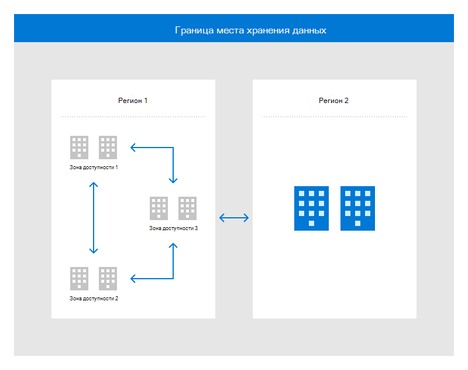

# Архитектура и инфраструктура центра обработки данных

Центр обработки данных Майкрософт разработан для реализации стратегии глубокой защиты с использованием нескольких уровней защиты для надежной защиты облачной архитектуры и поддержки инфраструктуры. Избыточность встроена во все системы на нескольких уровнях для поддержки доступности центра обработки данных.

Microsoft имеет высокооплачиваемую инфраструктуру центра обработки данных по всему миру, создавая распределенную инфраструктуру центра обработки данных, поддерживая тысячи онлайн-служб. Эта глобально распределенная инфраструктура предназначена для сближения приложений с пользователями, сохранения оседлости данных и предложения комплексных возможностей обеспечения соответствия требованиям и устойчивости для клиентов.

Регионы — это наборы центра обработки данных, которые связаны между собой через массивную и устойчивую сеть. Регионы организованы в географические области, поэтому для клиентов с определенными данными и соответствие требованиям требуется возможность хранить данные и приложения близко. Встроенная отказоустойчивость позволяет географическим регионам выдерживать полный отказ региона благодаря подключению к выделенной сетевой инфраструктуре с высокой емкостью.

Физически отдельные расположения в регионе называются зонами доступности, каждый из которых состоит из одного или нескольких центров обработки данных, оснащенных независимой властью, охлаждением и сетью. Зоны доступности позволяют критически важным приложениям работать с высокой доступностью и репликацией с низкой задержкой.

На следующем рисунке показано, как регион глобальной инфраструктуры и зоны доступности в пределах одной границы оседлости данных для высокой доступности, аварийного восстановления и резервного копирования.

Географически распределенные центры обработки данных позволяют Корпорации Майкрософт приближать службы к клиентам, уменьшать задержки в сети и позволяют резервное копирование и сбой в геоподержке.

## Доступность

Центр обработки данных Майкрософт разработан для обеспечения доступности на 99,999% для удовлетворения потребностей клиентов в службах. Корпорация Майкрософт инвестирует значительные средства в глобальные операции, управление, сети и устойчивость объектов, которые обеспечивают услуги 24x7x365.

## Стандарты и требования соответствия требованиям

Корпорация Майкрософт вложила более $15 млрд в создание глобальной инфраструктуры и более $9 млрд в исследования и разработки для повышения эффективности и внедрения инноваций. В результате центр обработки данных Майкрософт развивается более быстрыми темпами, чем многие объекты в отрасли, и поэтому не следует предписывательным требованиям, изложенным в традиционных стандартах центра обработки данных. В дополнение к богатым оперативным сведениям, полученным при запуске одного из крупнейших портфелей центра обработки данных в мире, Корпорация Майкрософт использует данные IEEE Gold Book и программное обеспечение моделирования надежности сторонних производителей для непрерывного улучшения стандартов проектирования центра обработки данных. Центр обработки данных Корпорации Майкрософт проводит масштабную проверку в рамках нескольких нормативных проверок, как это было вызвано в портфеле соответствия требованиям. Уровень зрелости в центрах обработки данных Майкрософт можно оценить с помощью портфеля соответствия требованиям и, в частности, сертификации ISO 22301.

Хотя Корпорация Майкрософт управляет программами в соответствии с духом инфраструктуры телекоммуникаций ANSI/TIA-942 стандарта datacenters Standard, часть этого стандарта не применима к Microsoft или не соответствует другим нормативным требованиям и/или требованиям, предъявляемым к конкретной стране. Кроме того, Корпорация Майкрософт решила использовать более основанный на производительности подход, чтобы соответствовать потребностям клиентов.

## Избыточность данных и сети

Критически важные объекты центров обработки данных используют несколько уровней избыточных систем, чтобы выдерживать сбои и свести к минимуму перерывы в работе служб. Локально избыточное хранилище на уровне диска защищает данные в пределах региона, а геоизбыточное хранилище обеспечивает избыточность внутри региона. Для обеспечения надежной сетевой связи корпорация Майкрософт владеет разнообразными оптоволоконными маршрутами и избыточным оборудованием и использует его для защиты критически важных компонентов от сбоев или перерывов в работе служб.

Гео репликация используется для обеспечения избыточности для альтернативных географических местоположений. Надежность данных получается путем синхронной репликации данных в нескольких базах данных в различных центрах обработки данных. Для всех данных резервного копирования, которые принадлежат облаку, выполняются тесты восстановления. Аварийное восстановление достигается путем асинхронной репликации в центр обработки данных в другом географическом регионе.

## Пропускная способность

Cloud Operations — это специальная группа емкостей, которая прогнозирует будущие требования, чтобы обеспечить структуру необходимой емкости и ее возможности для клиентского и внутреннего использования. Системы отслеживаются для обеспечения приемлемой производительности, доступности, использования службы, использования хранилища, задержки в сети и емкости журналов аудита. Корпорация Майкрософт также защищает центр обработки данных от последствий атак с отказом в обслуживании для пропускной способности, пропускной способности транзакций и емкости хранилища.

Все группы служб включают планирование емкости в качестве ключевой функции своих моделей центра обработки данных и планов репликации данных, чтобы обеспечить необходимые возможности для обработки информации, телекоммуникаций и поддержки окружающей среды.

## Питание

Центр обработки данных Корпорации Майкрософт посвятил 24x7 бесперебойным электроподдержкам (UPSs) и аварийной энергоподдержке, которая включает в себя генераторы на месте, которые обеспечивают резервное питание. Плановое техническое обслуживание и тестирование производится как для ИБП, так и генераторов, а рабочие группы заключают соглашения с локальными поставщиками топлива в случае чрезвычайной ситуации. Центры обработки данных также имеют выделенный центр операций для отслеживания систем электропитания, в том числе критически важных компонентов электрических систем.

Центр обработки данных Майкрософт оборудован защитными пространствами и соответствующей маркировкой для кабелей. Оборудование инфраструктуры питания размещено в средах, которые были спроектированы для защиты от экологических рисков. Для защиты от кражи или повреждения движения необходимо заблокировать или прикрепить все ресурсы портативных сетевых служб. Power cables are run under the floors, overhead in cable trays, and within cabinets for protection from moving parts and accidental damage. Все электрические пробелы находятся за считыватели карт или дополнительные блокировки ключей. Доступ к коридорам, внешним входам и дворам оборудования контролируется с помощью видеонаблюдения. Системы питания также используют избыточность в качестве одной из форм защиты, с несколькими каналами питания и утилиты в объекте, а также генераторами и системами UPS.

Для информационной системы, способной поддерживать мощность в минимально необходимых рабочих возможностях, реализуется долгосрочная альтернативная система питания. При сбойе питания или падении до неприемлемого уровня напряжения системы UPS мгновенно приходят в сеть. Это обеспечивает достаточно энергии для запуска серверов до тех пор, пока генераторы не смогут взять на себя. Аварийные генераторы обеспечивают резервное питание для расширенных отключений, планового обслуживания и могут управлять центром обработки данных с запасами топлива на месте в случае стихийного бедствия.

Центр обработки данных Корпорации Майкрософт (как арендованный, так и полностью управляемый) внедряет аварийное освещение в виде накладного аварийного освещения на выделенных схемах, которые поддерживается ups и генераторными системами. Автоматическое аварийное освещение реализуется в соответствии с Кодексом безопасности жизни Национальной ассоциации пожарной безопасности и защиты (NFPA) или применимым местным кодом/законом. В случае потери электроэнергии аварийное освещение автоматически переключается на питание, предоставляемую системами upS и генераторами. Системы аварийного освещения в центрах обработки данных проходят регулярное обслуживание, чтобы убедиться, что они остаются в рабочем состоянии.

## Обслуживание

Политика и процедуры обслуживания системы на месте в соответствии со стандартом физической и экологической безопасности Microsoft *Online Services.* Все оборудование и системы Майкрософт регулярно поддерживаются для обеспечения операционной эффективности. Обслуживание любого оборудования или системы должно выполняться в соответствии с рекомендациями производителя, выполняемых уполномоченным персоналом и записанных в билете на техническое обслуживание.

Существует две группы активов, которые поддерживают различные типы систем:

- **Группа critical Environment (CE):**

    - CE — это команда, которая предоставляет управление объектами для электрических, механических и физических систем, составляющих операционную инфраструктуру объекта. Группа ce расписаний, выполнения, документов и проверяет все действия по обслуживанию, выполняемые на компонентах CE. Центр обработки данных Майкрософт опирается на компьютеризированную систему для управления графиками обслуживания и заказами на работу.
    - Управление центрами обработки данных (DCM) отвечает за все техническое обслуживание ce, выполняемые на сайте или удаленно. Обслуживание CE прописано в необходимых пошаговом документе под названием Methods of Procedure (MOP). Перед началом работы руководство центра обработки данных просматривает и утверждает moPs.

- **Команда служб сайта:**

    - Служба веб-сайтов — это команда, которая обеспечивает обслуживание активов онлайн-служб Майкрософт, расположенных в центре обработки данных Майкрософт. Команда службы веб-сайтов DC предоставляет службу исправления "умные руки/брейк" для активов, принадлежащих службам обеспечения свойств из центра обработки данных. Например, активы, требующие физического обслуживания, могут запрашивать службу "умные руки" из группы служб веб-сайтов DC. Все веб-службы, которые работают над активами Майкрософт, запланированы, выполняются, документируются и рассматриваются в билетах на работу в инструменте продажи билетов рабочего процесса, и без утвержденного рабочего билета работа не может выполняться.
    - Руководитель технической программы (TPM) и группа DCM отвечают за все работы службы сайтов, которые происходят в центр обработки данных и которые требуют передачи актива за ее место. Обслуживание служб сайта выполняется в областях центра обработки данных, которые контролируются и защищаются физическими механизмами безопасности.

Если компоненты CE требуются для удаления из объекта, обработка оборудования утверждается DCM. В большинстве случаев компоненты CE получают обслуживание на месте и не удаляются из объекта. Активы свойств (например, сетевые устройства или серверы), требующие передачи offsite, должны иметь явное утверждение владельца активов.

Цифровые носитли в облаке не могут транспортироваться из пространства colocation, если оно не будет перемещено для уничтожения. При уничтожении этих активов они хранятся в заблокированных хранилищах, которые находятся под камерой видеонаблюдения. Когда активы будут готовы к уничтожению, сотрудник службы физической безопасности и сотрудник Корпорации Майкрософт, полный рабочий день из службы управления активами, должны сопровождать заблокированный ящик из пространства размещения в место, где будет происходить измельчиние на месте. По мере того, как в центрах обработки данных и под наблюдением Майкрософт происходит измельчение, активы Майкрософт не покидают контролируемые зоны центра обработки данных.

Все работы по обслуживанию должны быть утверждены до начала работы, включая доступ к средствам обслуживания системы. Инфраструктура Майкрософт реализовала управление средствами технического обслуживания, создав уровень доступа в средстве доступа к центру обработки данных (DCAT). Каждый объект содержит ограниченное физическое окно блокировки или комнату, контролируемую доступом, для хранения специализированных средств обслуживания. Доступ к окне блокировки или комнате хранения контролируется в средстве DCAT, чтобы запретить несанкционированный доступ к средствам обслуживания. Эта программа гарантирует, что только персонал с утвержденным доступом может получить доступ к средствам. Группа служб сайтов выполняет плановые проверки инвентаризации для проверки состояния всех средств. На ежеквартной основе группа управления центрами обработки данных и группы физической безопасности выполняют аудит списка доступа DCAT, чтобы сохранить текущий список доступа обслуживаемого персонала. Увольнения или переводы персонала отражаются немедленно с помощью ручного обновления списка доступа. Доступ к окне блокировки или комнате хранения технического обслуживания отслеживается в журналах чтения значков доступа, которые доступны для любых исследований.

Группа служб сайта ведет инвентаризацию утвержденных средств обслуживания для использования в центрах обработки данных. Персонал службы технического обслуживания направляется на использование предоставленных средств обслуживания. Для использования средств, не предоставляемых центром обработки данных, требуется утверждение центра управления данными. Физические средства рук освобождаются от этого типа управления.

Центр обработки данных Майкрософт поддерживает обслуживающих сотрудников резидентов для поддержки критически важных систем инфраструктуры центра обработки данных (группы критически важных сред) и операций центра обработки данных (команда служб сайта). Группы критически важных служб среды и веб-сайтов определили критически важные компоненты системы безопасности и технологий, которые они поддерживают запасные части для на месте. Службы критически важных информационных систем предостеречены из более чем одного центра обработки данных, чтобы предотвратить прерывание службы из-за инцидента в одном из центрах обработки данных.
