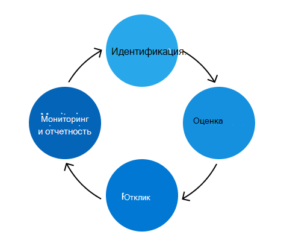

# Microsoft 365 Программа управления рисками

Целью программы управления Microsoft 365 рисками является определение, оценка и управление рисками для Microsoft 365. Microsoft 365 приоритетом является обеспечение выполнения договорных обязательств и аккредитаций, повышение доверия клиентов и сохранение конкурентных преимуществ. Хотя программа Microsoft 365 управления рисками функционирует независимо, она согласуется с Enterprise политики, приоритеты и методологии программы управления рисками (ERM). Работа с программой ERM позволяет последовательно сравнивать бизнес-подразделения и инженерные группы, способствуя более согласованному подходу к управлению рисками на предприятии.

Группа Microsoft 365 trust отвечает за управление программой управления Microsoft 365 рисками и проведение мероприятий, изложенных в программе ERM. Группа trust фокусируется на интеграции инфраструктуры управления рисками с существующими Microsoft 365, операциями службы и процессом соответствия требованиям, чтобы сделать программу управления рисками более эффективной и эффективной.

Группа trust также поддерживает Microsoft 365 Controls Framework, набор рационализированных элементов управления, которые при правильной реализации с поддержкой действий по обеспечению соответствия требованиям позволяют инженерным группам выполнять ключевые правила и сертификации. Эта структура постоянно обновляется на основе отзывов и выводов в рамках процесса управления рисками.

Действия по управлению рисками подпадают под четыре этапа: идентификация, оценка, реагирование и мониторинг и отчетность.

## Идентификация

Процесс управления рисками начинается с определения всех возможных рисков для всех ключевых областей управления, внутренних и внешних угроз и уязвимостей в Microsoft 365 среде. Информация, направляющая этот процесс, поступает из нескольких источников, включая интервью, проверку уязвимости, имитацию атак, результаты аудита и действия по управлению инцидентами.

Группа Trust опрашивает специалистов по субъектам (МСП) из нескольких групп служб по ранее выявленным рискам и потенциальным будущим рискам, которые могут быть введены по мере роста служб. Кроме того, МСП помогают проверить точность и полноту рисков, выявленных из других источников непрерывного мониторинга.

На этапе идентификации также рассматриваются журналы решений, исключения активной безопасности и соответствия требованиям, а также работа по смягчению последствий предыдущих оценок рисков.

## Оценка

Каждый выявленный риск оценивается с помощью трех показателей: влияния, вероятности и дефицита управления.

- Влияние относится к ущербу, который будет нанесен службе, бизнесу или Корпорации Майкрософт, если этот риск будет реализован. Последствия для Корпорации Майкрософт могут включать повреждение репутации, потерю клиентов или юридические последствия.
- Вероятность определяет вероятность возможного риска и вычисляется путем анализа вероятности и частоты, с которой он будет происходить.
- Дефицит элементов управления измеряет эффективность реализованных элементов управления смягчением последствий.

Эти метрики используются для вычисления оценки риска, которая представляет серьезность каждого риска, с учетом существующих стратегий смягчения последствий. Риски агрегируются и представляются ключевым заинтересованным сторонам из каждой службы для проверки точности и полноты Microsoft 365 осанки риска.

## Отклик

Используя проверенный список рисков для Microsoft 365, группа Trust назначает риски пострадавшей службе для реагирования на риски. Определенные рекомендации помогают определить соответствующую стратегию реагирования на риск на основе показателей риска и эффективности управления. Стратегии реагирования на риски подпадают под четыре категории:

- Перенос: области с низким уровнем риска с низким уровнем контроля.
- Operate: Области с низким уровнем риска, где элементы управления считаются достаточными.
- Monitor. Области, подверженные высокому риску, где элементы управления считаются достаточными и должны контролироваться для обеспечения эффективности.
- Улучшение. Области с высокой степенью риска с низким уровнем контроля, которые являются главными приоритетами в решении.

Группа Trust координирует работу с группами служб для разработки планов по устранению каждого риска. Уровень серьезности определяет соответствующий уровень проверки и утверждения для каждого плана. Для рисков, которые требуют действий, существующие процессы инженерных ошибок используются для отслеживания, управления и принятия решений об исключениях. Использование процесса, знакомого инженерным и оперативным группам, позволяет эффективнее и эффективнее реагировать на риски.

## Мониторинг и отчетность

Риски, выявленные в рамках оценки риска, отслеживаются и сообщаются соответствующим заинтересованным сторонам. Стратегии мониторинга включают мониторинг безопасности, периодические проверки рисков, тестирование на проникновение и сканирование уязвимостей. Эти усилия по мониторингу выступают в качестве источников данных для отчетности по ключевым показателям производительности, создания панелей мониторинга и разработки официальных отчетов, все из которых информируют о будущих решениях по рискам.

Несколько раз в год группа "Доверие" встречается с владельцами рисков из каждой службы, чтобы проанализировать оценки рисков, оценить эффективность планов действий и при необходимости обновлять их. Кроме того, Microsoft 365 деятельности по оценке рисков в рамках программы ERM Enterprise оценки рисков, которые предоставляют высокий обзор позиции риска Корпорации Майкрософт для высшего руководства Корпорации Майкрософт и программы ERM.
