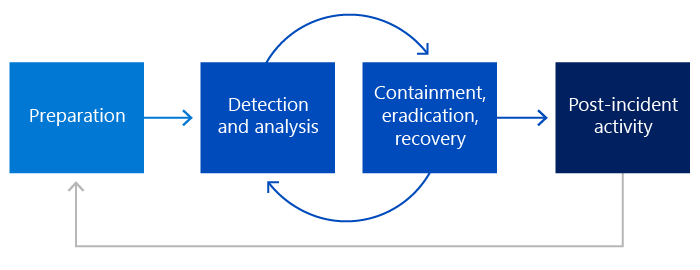

# Управление инцидентами безопасности Майкрософт

Корпорация Майкрософт непрерывно обеспечивает высокобезопасные корпоративные службы для клиентов Майкрософт, но инциденты с безопасностью являются неизбежной реальностью, которую необходимо тщательно и быстро управлять. В этом документе представлен обзор того, как Корпорация Майкрософт обрабатывает инциденты безопасности с помощью опробованых и верных методов и технологий, чтобы свести к минимуму их потенциальное воздействие. Инцидент с безопасностью относится к любому незаконному доступу к данным клиентов, хранимым на оборудовании Майкрософт или на объектах Корпорации Майкрософт, или несанкционированному доступу к такому оборудованию или средствам, которые могут привести к потере, раскрытию или изменению данных клиентов. Цели Корпорации Майкрософт при реагировании на инциденты с безопасностью — защита данных клиентов и сетевых служб Майкрософт.

Группы безопасности веб-служб Майкрософт и различные группы служб работают совместно и принимают тот же подход к инцидентам безопасности:

- Подготовка
- Обнаружение и анализ
- Сдерживание, ликвидация и восстановление
- Действие после инцидента

## Подход Корпорации Майкрософт к управлению инцидентами безопасности

Подход Корпорации Майкрософт к управлению инцидентом безопасности соответствует специальной публикации Национального института стандартов и технологий [(NIST)](https://www.nist.gov/) 800-61. Корпорация Майкрософт имеет несколько специализированных групп, которые работают вместе для предотвращения, мониторинга, обнаружения и реагирования на инциденты безопасности.

|**Team/Area**|**Описание**|
|:------------|:--------------|
| Центр реагирования на безопасность Майкрософт | Определяет, отслеживает, устраняет и реагирует на инциденты безопасности и уязвимости безопасности программного обеспечения Майкрософт. |
| Центр операций киберзащиты | Центр операций киберзащиты — это физическое расположение, которое объединяет группы реагирования на угрозы и экспертов со всей компании, чтобы помочь в защите, обнаружении и реагировании на угрозы в режиме реального времени. |
| Корпоративные, внешние и юридические дела | Предоставляет юридические и нормативные рекомендации по предполагаемому инциденту с безопасностью. |
| Группа безопасности центра обработки данных Майкрософт | Группа, которая фокусируется на различных службах на общих инвестициях в разработку безопасности для защиты, обнаружения и реагирования на риски и угрозы архитектуры службы. |
| Группы реагирования на безопасность Майкрософт | Независимые Azure, Dynamics 365 и Microsoft 365, которые сотрудничают с группами служб, чтобы создать соответствующий процесс управления инцидентами безопасности и управлять любыми ответными мерами на инциденты безопасности. |
| Группы microsoft Governance, Risk и Compliance (GRC) | Руководство по нормативным требованиям, соблюдению требований и конфиденциальности. |
| Группы обслуживания | Группы разработки Для Azure, Dynamics 365, Microsoft 365, которые отвечают за политики и решения, связанные с безопасностью для каждой службы. |
| Диспетчеры операций Azure | Осуществляет надзор за расследованием и разрешением инцидентов безопасности и конфиденциальности, связанных с Azure. |
| Центр аналитики угроз Майкрософт (MSTIC) | Предоставляет современные возможности в области цифровых угроз безопасности в отношении инфраструктуры и активов Майкрософт, помогает группам партнеров в Корпорации Майкрософт определить приоритеты планов действий по смягчению последствий и предупреждению, а также повышает уровень защиты за счет принятия практически в режиме реального времени мониторинга и обнаружения инцидентов. |
| Группы взаимодействия с клиентами | Инженерные группы, ответственные за все сообщения клиентов о инцидентах безопасности и службы. Отдельные группы посвящены Azure, Dynamics 365 и Microsoft 365. |

## Процесс управления ответами

Группы безопасности и группы служб Microsoft online services работают вместе и принимают тот же подход к инцидентам безопасности, который основан на этапах управления ответами NIST 800-61:

- **Подготовка.** Относится к организации подготовки, которая необходима для реагирования, включая средства, процессы, компетенции и готовность.
- **Анализ &** обнаружения. Относится к действию по обнаружению инцидента безопасности в производственной среде и анализу всех событий, чтобы подтвердить подлинность инцидента безопасности.
- **Сдерживание, ликвидация,** восстановление. Ссылается на необходимые и соответствующие действия, принятые для сдерживания инцидента безопасности на основе анализа, проведенного на предыдущем этапе. Кроме того, на этом этапе может потребоваться дополнительный анализ для полного восстановления после инцидента с безопасностью.
- **Действие после инцидента**. Ссылается на анализ посмертных данных, выполняемый после восстановления инцидента безопасности. Оперативные действия, выполняемые во время процесса, проверяются для определения необходимости внесения каких-либо изменений на этапах подготовки или обнаружения и анализа.

## Federated security response model

Онлайн-службы Microsoft состоят из основных продуктов Microsoft, включая Azure, Dynamics 365 и Microsoft 365. Каждая из этих служб управляется отдельными группами с собственными операционными процессами безопасности. Другие группы в Microsoft, например MSTIC, также занимаются различными аспектами безопасности сетевых служб Майкрософт. Из-за множества групп, работающих над управлением операциями безопасности во всех различных службах, в которые составляются онлайн-службы Microsoft, Корпорация Майкрософт реализовала федераированную модель реагирования на безопасность.

В этой таблице представлены операционные границы между различными группами операций по безопасности онлайн-служб Майкрософт и группами служб Майкрософт:

|**Действие**|**Операции группы безопасности Майкрософт**|**Операции группы служб Майкрософт**|
|:-----------|:-----------------------------------------|:----------------------------------------|
| Обнаружение и анализ | - Требования обнаружения   - Мониторинг и анализ безопасности   - Индикатор компромиссных зачисток (МОК)   - Поиск нарушений   - 24x7 руководство по реагированию на вызов и реагирование на инциденты | - Требования обнаружения   - Мониторинг развертывания инфраструктуры   - Анализ и анализ служб   - Триадж событий и оповещений   - 24x7 инженерная служба по вызову  |
| Сдерживание, ликвидация, восстановление | - Руководство по реагированию на инциденты   - Судебно-медицинское расследование   - Экспертиза и консультации по безопасности   - Инструкции по восстановлению | - Владелец инцидента безопасности   - Сведения о службе и экспертиза   - Выполнение сдерживания, ликвидации и восстановления |
| Действия после инцидента | - Руководство по анализу после инцидента   - Сбор данных и архивные данные   - Извлеченные уроки и запросы на ошибку   - Отчет об инцидентах | - Анализ инцидентов на стороне службы   - Приоритеты последующих действий   - Инвестиции в безопасность реализации   - Готовность к безопасности службы |

## Статьи по теме

- [Управление инцидентами безопасности Майкрософт: подготовка](assurance-sim-preparation.md)
- [Управление инцидентами безопасности Майкрософт: обнаружение и анализ](assurance-sim-detection-analysis.md)
- [Управление инцидентами безопасности Майкрософт: сдерживание, ликвидация и восстановление](assurance-sim-containment-eradication-recovery.md)
- [Управление инцидентами безопасности Майкрософт: действие после инцидента](assurance-sim-post-incident-activity.md)
