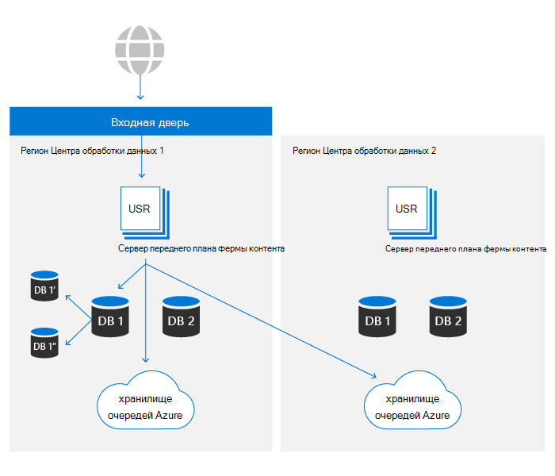
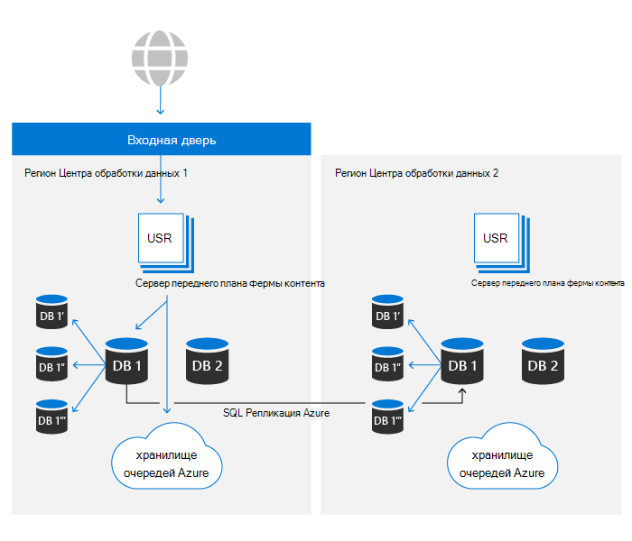

# Устойчивость данных SharePoint и OneDrive в Microsoft 365

В Microsoft 365 OneDrive на основе платформы SharePoint файлов. В этой статье только SharePoint будут использоваться для ссылок на оба продукта. Содержимое этой статьи имеет отношение к Microsoft 365 и не применяется к потребительским службам.

Существует два основных актива, которые составляют основное хранилище контента SharePoint:

- **Метаданные.** Метаданные о каждом файле хранятся в База данных SQL Azure. Azure SQL предоставляет полный рассказ о непрерывности бизнеса, SharePoint и подробные сведения, охватываемых позднее в этой статье.
- **Хранилище Blob.** Содержимое пользователя, загружаемого в SharePoint, хранится в служба хранилища Azure. SharePoint создал настраиваемый план устойчивости поверх служба хранилища Azure, чтобы обеспечить почти в режиме реального времени дублирование пользовательского контента и действительно активную/активную систему.

Полный набор элементов управления для обеспечения устойчивости данных объясняется в дальнейших разделах.

## Устойчивость к хранению Blob

SharePoint имеет настраиваемые решения для хранения данных клиентов в служба хранилища Azure. Каждый файл одновременно вписаны в основной и вторичный центр обработки данных. Если записи в регион Azure сбой, сохранение файла не удастся. После записи содержимого в служба хранилища Azure, проверки хранятся отдельно с метаданными и используются для обеспечения того, чтобы совершенная записи идентична исходному файлу, отправленным в SharePoint во время всех будущих считывок. Этот же метод используется во всех процессах для предотвращения распространения любого повреждения, которое должно произойти. В каждом регионе azure Locally Redundant служба хранилища (LRS) обеспечивает высокий уровень надежности. Сведения [см. в служба хранилища Azure статье](/azure/storage/common/storage-redundancy-lrs) избыточности.

SharePoint использует Append-Only хранения. Этот процесс гарантирует, что файлы не могут быть изменены или повреждены после первоначального сохранения, но также с помощью версии в продукте можно получить любую предыдущую версию содержимого файла.

SharePoint среды в любом из центра обработки данных могут получать доступ к контейнерам хранения в обоих регионах Azure. По причинам производительности контейнер хранения в одном локальном центр обработки данных всегда предпочтительнее, однако запросы на чтение, которые не видят результатов в пределах нужного порога, будут иметь тот же контент, который запрашивается в удаленном центрах обработки данных для обеспечения всегда доступных данных.

## Устойчивость метаданных

SharePoint метаданные также имеют решающее значение для доступа к пользовательскому контенту, так как хранятся ключи доступа к контенту, хранямуся в служба хранилища Azure. Эти базы данных хранятся в Azure SQL, которая имеет обширный план [непрерывности бизнеса.](/azure/sql-database/sql-database-business-continuity)

SharePoint использует модель репликации, предоставленную Azure SQL и выстроив проприетарную технологию автоматизации, чтобы определить необходимость сбой и при необходимости инициировать операцию. Таким образом, он попадает в категорию "Ручная неудача базы данных" с точки SQL Azure. Последние показатели восстановления баз данных Azure SQL доступны [здесь.](/azure/azure-sql/database/business-continuity-high-availability-disaster-recover-hadr-overview#recover-a-database-to-the-existing-server)

SharePoint использует систему резервного копирования Azure SQL, чтобы включить пункт восстановления времени (PITR) на срок до 14 дней. PitR подробнее освещается в более [позднем разделе.](#deletion-backup-and-point-in-time-restore)

## Автоматическая сбойная система

SharePoint с помощью настраиваемого автоматического сбойного сбойного действия, чтобы свести к минимуму влияние на клиентскую службу при событии, определенном для конкретного расположения. Автоматизация на основе мониторинга, обнаруживаемая один или несколько компонентов сбоя за пределами определенных пороговых значений, приведет к автоматическому перенаправлению активности всех пользователей из проблемной среды в теплую вторичную. Сбой приводит к тому, что метаданные и вычислительные хранилища обслуживаются полностью из нового центра обработки данных. Поскольку хранилище blob всегда выполняется полностью активно и активно, для сбоя не требуется никаких изменений. Вычислительный уровень предпочтет ближайший контейнер blob, но в любое время будет использовать локальные и удаленные хранилища BLOB для обеспечения доступности.

SharePoint служба входных дверей Azure предоставляет внутреннюю маршрутику в сеть Майкрософт. Эта конфигурация позволяет перенаправление с выходом из строя независимо от DNS и снижает эффект кэшации локальной машины. Большинство операций по сбойу прозрачны для конечных пользователей. При сбойе клиенты не должны будут вносить какие-либо изменения, чтобы сохранить доступ к службе.

## Восстановление версий и файлов

Для вновь созданных библиотек документов SharePoint по умолчанию до 500 версий для каждого файла и при желании можно настроить, чтобы сохранить больше версий. Пользовательский интерфейс не позволяет устанавливать значение менее 100 версий, но можно настроить систему для хранения меньше версий с помощью общедоступных API. Для надежности любое значение менее 100 не рекомендуется и может привести к непреднамеренным потерям данных.

Дополнительные сведения о версии см. в [SharePoint.](/microsoft-365/community/versioning-basics-best-practices)

Восстановление файлов — это возможность "вернуться во времени" в любую библиотеку документов в SharePoint в любую секунду за последние 30 дней. Этот процесс можно использовать для восстановления после вымогателей, массовых удалений, коррупции или любого другого события. Эта функция использует версии файлов, поэтому уменьшение версий по умолчанию может снизить эффективность этого восстановления.

Функция Восстановления файлов документируется как для [OneDrive,](https://support.office.com/article/restore-your-onedrive-fa231298-759d-41cf-bcd0-25ac53eb8a15) так и [для SharePoint.](https://support.office.com/article/Restore-a-document-library-317791c3-8bd0-4dfd-8254-3ca90883d39a)

## Удаление, резервное копирование и восстановление времени

Пользовательский контент, удаленный из SharePoint, проходит через следующий поток удаления.

Удаленные элементы сохраняются в корзинах в течение определенного периода времени. Для SharePoint время хранения — 93 дня. Он начинается при удалении элемента из исходного расположения. При удалении элемента из корзины сайта он попадает в корзину для [сбора веб-сайтов.](https://support.office.com/article/restore-deleted-items-from-the-site-collection-recycle-bin-5fa924ee-16d7-487b-9a0a-021b9062d14b) Он остается там до конца 93 дней, а затем окончательно удаляется. Дополнительные сведения об использовании корзины доступны по этим ссылкам:

- [Восстановление элементов в корзине](https://support.office.com/article/Restore-items-in-the-Recycle-Bin-of-a-SharePoint-site-6df466b6-55f2-4898-8d6e-c0dff851a0be)
- [Восстановление удаленных элементов из корзины коллекции сайтов](https://support.office.com/article/Restore-deleted-items-from-the-site-collection-recycle-bin-5fa924ee-16d7-487b-9a0a-021b9062d14b).

Этот процесс является потоком удаления по умолчанию и не учитывает политики хранения или метки. Дополнительные сведения см. в дополнительных сведениях о [удержании SharePoint и OneDrive.](/microsoft-365/compliance/retention-policies-sharepoint)

После завершения 93-дневного конвейера по переработке удаление происходит независимо для метаданных и для Blob служба хранилища. Метаданные будут немедленно удалены из базы данных, что делает содержимое нечитаемым, если метаданные не будут восстановлены из резервного копирования. SharePoint поддерживает резервное копирование метаданных в течение 14 дней. Эти резервные копии принимаются локально в режиме реального времени, а затем  перенадвигаются на хранение в избыточных контейнерах служба хранилища Azure, согласно документации на момент публикации, в расписании на 5-10 минут.

При удалении Blob служба хранилища, SharePoint использует функцию мягкого удаления для Azure Blob служба хранилища для защиты от случайного или вредоносного удаления. С помощью этой функции у нас есть в общей сложности 14 дней для восстановления контента, прежде чем он будет окончательно удален.

>[!Note]
>В то время как приложения Майкрософт будут отправлять содержимое в корзину для стандартного процесса, SharePoint предоставляет API, которые позволяют пропустить корзину и заставить немедленно удалить. Просмотрите приложения, чтобы убедиться, что это делается только в случае необходимости по соображениям соответствия требованиям.

## Проверки целостности

SharePoint использует различные методы для обеспечения целостности blobs и метаданных на всех этапах жизненного цикла данных:

- **Hash файла,** хранимый в метаданных: Hash всего файла хранится с метаданными файлов для обеспечения целостности данных уровня документов во время всех операций
- **Hash Blob,** хранимый в метаданных: каждый элемент blob хранит хаш зашифрованного контента для защиты от коррупции в основном хранилище Azure.
- **Задание целостности** данных. Каждые 14 дней каждый сайт проверяется на целостность, перечисляя элементы в базе данных и соединив их с перечисленными blobs в хранилище Azure. Задание сообщает о недоставках blob-blob-blobs и может получить эти blobs через функцию мягкого удаления хранилища [Azure](/azure/storage/blobs/soft-delete-blob-overview) при необходимости.
