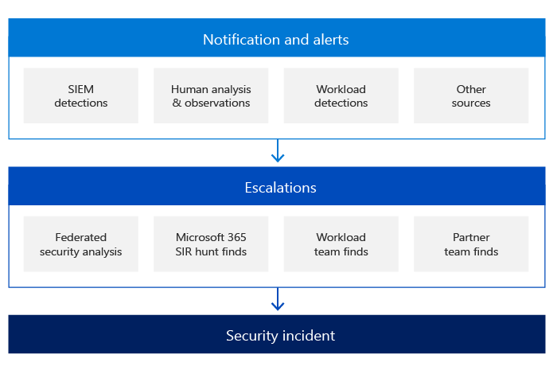

# Управление инцидентами безопасности Майкрософт: обнаружение и анализ

Для обнаружения вредоносных действий каждая из онлайн-служб Майкрософт централизованно регистрировать события безопасности и другие данные и выполнять различные аналитические методы для обнаружения аномальной или подозрительной активности. Файлы журналов собираются с серверов и устройств инфраструктуры microsoft online-служб и хранятся в центральных и консолидированных базах данных.

Корпорация Майкрософт принимает рискованный подход к обнаружению вредоносных действий. Мы используем данные об инцидентах и сведения об угрозах для определения и определения приоритетов обнаружения.

Использование команды высококвалифицированных, опытных и опытных специалистов является одним из важнейших столпов успеха на этапе обнаружения и анализа. Корпорация Майкрософт использует несколько групп служб, включающих сотрудников с компетенциями во всех компонентах в стеке, включая сеть, маршрутизаторы, брандмауэры, балансиры нагрузки, операционные системы и приложения.

Механизмы обнаружения безопасности в онлайн-службах Microsoft также включают уведомления и оповещения, инициированные различными источниками. Группы реагирования на угрозы безопасности веб-служб Майкрософт являются ключевыми оркестраторами процесса эскалации инцидентов безопасности. Эти группы получают все эскалации и несут ответственность за анализ и подтверждение действительности инцидента безопасности.

Одним из основных столпов обнаружения является уведомление:

- Каждая команда служб отвечает за журнал любых действий или событий внутри службы на основе требований группы безопасности службы в Интернете. Все журналы, созданные различными группами служб, обрабатываются решением по управлению сведениями о безопасности и событиями (SIEM) с заранее созданными правилами обнаружения и безопасности. Эти правила развиваются на основе рекомендаций группы безопасности на основе сведений, которые были выучили из предыдущих инцидентов безопасности, чтобы определить, есть ли какие-либо подозрительные или вредоносные действия.
- Если клиент определяет, что инцидент с безопасностью продолжается, он может открыть случай поддержки с Корпорацией Майкрософт, которая назначена группе связи Майкрософт и превратилась в эскалацию для всех соответствующих групп.

Группы служб Azure, Dynamics 365 и Microsoft 365 также используют сведения, полученные при анализе тенденций, с помощью мониторинга безопасности и ведения журнала для обнаружения нарушений в информационных системах веб-служб Майкрософт, которые могут указывать на атаку или инцидент с безопасностью. Системы сетевых служб Майкрософт агрегировали выход из этих журналов в производственной среде в централизованные серверы ведения журнала. С этих централизованных серверов ведения журнала журналы проверяются на месте тенденций во всей производственной среде. Данные, агрегированные на централизованных серверах, надежно передаются в службу ведения журнала для расширенных запросов, создания панели мониторинга и обнаружения аномальной и вредоносной активности. Служба также использует машинное обучение для обнаружения аномалий с выходом журнала.

На этапе эскалации и в зависимости от характера инцидента с безопасностью группы реагирования на безопасность могут привлекать одного или нескольких специалистов по темам из различных групп в Корпорации Майкрософт:

- Команда по безопасности и соблюдению требований к службам в Интернете
- Центр аналитики угроз Майкрософт (MSTIC)
- Центр реагирования на безопасность Майкрософт (MSRC)
- Корпоративные, внешние и юридические дела (CELA)
- Безопасность Azure
- Microsoft 365 и другие.

Перед эскалацией любой группы реагирования на безопасность команда службы отвечает за определение и определение уровня серьезности инцидента безопасности на основе определенных критериев, таких как:

- Конфиденциальность
- Влияние
- Область
- Число пострадавших клиентов
- Регион
- Служба
- Сведения об инциденте
- Конкретные клиенты или правила рынка.

Приоритизация инцидентов определяется с помощью различных факторов, в том числе функциональных последствий инцидента, информационного воздействия инцидента и восстановления после инцидента.

Получив эскалацию в связи с инцидентом безопасности, группа безопасности организует виртуальную группу (v-team), состоящую из членов группы реагирования на угрозы безопасности онлайн-служб Майкрософт, групп служб и группы связи с инцидентами. Затем v-team должна подтвердить законность инцидента с безопасностью и устранить все ложные срабатывалки. Точность сведений, предоставляемых индикаторами, определяемой на этапе подготовки, имеет решающее значение. Анализируя эту информацию по категории векторной атаки, группа v-team может определить, является ли инцидент безопасности законным.

В начале расследования группа реагирования на инциденты безопасности записи всю информацию об инциденте в соответствии с нашими политиками управления случаем. По мере развития дела мы отслеживаем текущие действия и следуем стандартам обработки доказательств для сбора, хранения и защиты этих данных на протяжении всего жизненного цикла инцидента.

Примеры таких действий:

- Сводка, которая является кратким описанием инцидента и его потенциального воздействия
- Серьезность и приоритет инцидента, полученные путем оценки потенциального воздействия
- Список всех выявленных индикаторов, которые привели к обнаружению инцидента
- Список всех связанных инцидентов
- Список всех действий, принятых командой v
- Все собранные доказательства, которые также будут сохранены для анализа после смерти и будущих судебных расследований
- Рекомендуемые дальнейшие действия

После подтверждения инцидента безопасности основными целями группы реагирования на безопасность и соответствующей группы служб являются сдерживание атаки, защита службы(ы) под атакой и предотвращение более глобального воздействия. В то же время соответствующие группы инженеров работают над определением первой причины и подготовкой первого плана восстановления.

На следующем этапе группа реагирования на безопасность определяет клиента(ы), пострадавшего от инцидента с безопасностью, если таковые есть. Область действия может занять некоторое время, чтобы определить в зависимости от региона, центра обработки данных, службы, фермы серверов, сервера и так далее. Список пострадавших клиентов составляется командой служб и соответствующей командой коммуникаций Майкрософт, которые обрабатывают процесс уведомления клиентов в рамках договорных обязательств и соответствия требованиям.

## Статьи по теме

- [Управление инцидентами безопасности Майкрософт](assurance-security-incident-management.md)
- [Управление инцидентами безопасности Майкрософт: подготовка](assurance-sim-preparation.md)
- [Управление инцидентами безопасности Майкрософт: сдерживание, ликвидация и восстановление](assurance-sim-containment-eradication-recovery.md)
- [Управление инцидентами безопасности Майкрософт: действие после инцидента](assurance-sim-post-incident-activity.md)
- [Как войти в журнал билета поддержки событий безопасности](/azure/security/fundamentals/event-support-ticket)
- [Azure и Dynamics 365: уведомление о нарушении безопасности данных согласно GDPR](/compliance/regulatory/gdpr-breach-azure-dynamics)
