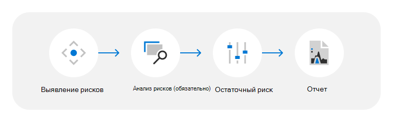

# Оценка угроз, уязвимостей и риска для центров обработки данных

Корпорация Майкрософт предоставляет клиентам более 200 облачных служб 24x7x365. В качестве примеров можно привести такие корпоративные службы, как Microsoft Azure, Microsoft Office 365, Microsoft Dynamics и потребительские службы, такие как Bing, MSN, Outlook.com, Skype и Xbox Live. Эти службы находятся в облачной инфраструктуре Майкрософт: глобально распределенных центрах обработки данных, края вычислительных узлах и центрах операций служб, а также одной из крупнейших глобальных сетей в мире; с обширным волокном, соединяющим их все. С момента открытия первого центра обработки данных в 1989 г. Корпорация Майкрософт инвестировала миллиарды долларов в нашу инфраструктуру и по-прежнему сосредоточена на доставке надежных, масштабируемых и усиленных безопасности онлайн-служб, а также эффективного управления операциями и затратами по мере роста служб.

Облачные службы Майкрософт строятся на основе доверия и безопасности, при этом основное внимание уделяется защите данных и приложений клиентов в облаке с помощью самых современных технологий, процессов и шифрования. Данные клиентов хранятся в центрах обработки данных Майкрософт, которые географически распределены и защищены слоями глубоких логических и физических мер безопасности. Центр обработки данных Майкрософт разработан и управляется для защиты служб и данных от вреда от стихийных бедствий, экологических угроз или несанкционированного доступа.

## Методология оценки угроз, уязвимостей и рисков

Программа "Угроза, уязвимость и оценка рисков" (TVRA) помогает понять, как Корпорация Майкрософт определяет и смягчает воздействие физических и экологических угроз на центр обработки данных Майкрософт. Корпорация Майкрософт стремится постоянно обновлять свои оценки рисков и методологии для улучшения и изменения условий. В результате анализы и выводы TVRA могут изменяться, а отчеты рассматриваются в пункте времени.

Корпорация Майкрософт упрощает процесс TVRA, следуя следующим шагам:

### Выявление рисков

TVRAs рассматривают широкий диапазон сценариев угроз, связанных с естественными и созданными людьми (включая случайные) опасности. Результаты будут отличаться в зависимости от расположения центра обработки данных, дизайна, области служб и других факторов. TVRA выбирает сценарии угроз, которые необходимо выделить в документе TVRA, основываясь на требованиях клиентов, независимой стране, городе и на уровне сайтов оценке среды риска, предоставляемой данными о рисках 3rd-party и 1st-party. Для регионов с несколькими центрами обработки данных рейтинги TVRA агрегируются для обеспечения целостного представления о физических и экологических угрозах, уязвимостях и рисках для оцениваемого расположения.

Типы сценариев угроз, рассматриваемые при оценке угроз, уязвимостей и риска (TVRA) для центра обработки данных:

- **Внешние угрозы:** инциденты в результате внешних преднамеренных или случайных действий человека. Например, гражданские беспорядки, терроризм, преступная деятельность, внешние кражи, самодельные взрывные устройства, вооруженные нападения, поджоги, несанкционированный вход и авиакатастрофы.
- **Внутренние угрозы:** инциденты, прогремеющие в результате внутренних преднамеренных или случайных действий человека. Например, внутренняя кража и саботаж.
- **Природные опасности:** естественный процесс или явление, которое может негативно повлиять на центр обработки данных. Например, тропические штормы, циклоны, наводнения, оползни, засуха, лесные пожары, землетрясения, вулканическая активность и сильные штормы с молнией, градом, сильными ветрами или сильными дождями.
- **Экологические угрозы:** экологические условия, которые могут негативно повлиять на центр обработки данных. Например, водный стресс, тепловой стресс и пандемии.

### Анализ рисков

Угрозы оцениваются на основе оценки их присущего им риска; присущее риску вычисляется как функция неотъемлемого воздействия угрозы и присущей ей вероятности возникновения угрозы при отсутствии действий и элементов управления. Эти оценки информируются как внутренними экспертами по субъектам (МСП), так и внешними индексами риска.

### Остаточный риск

Остаточный риск определяется как мера оставшихся уровней риска после рассмотрения эффективности управления. Эффективность управления оценивается как мера текущих действий и элементов управления, предназначенных для предотвращения или обнаружения угроз, а также оценки вероятности того, что элементы управления будут иметь желаемый эффект в том виде, в который они разработаны и реализованы. Эти оценки основаны на совокупности отзывов внутренних экспертов по данной теме (SME ) по вопросам эффективности управления для местоположений центров обработки данных, о которых говорится в TVRA.

### Отчет

После завершения оценки создается отчет TVRA для утверждения руководства и поддержки общих усилий, связанных с управлением рисками.

## Ресурсы

- [Глобальная инфраструктура Azure](https://www.microsoft.com/datacenters)
